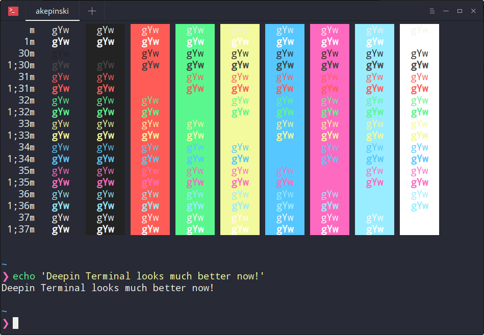

# deepin-snazzy

> Elegant [Linux Deepin Terminal](https://www.deepin.org/en/2016/09/22/deepin-terminal-v2-0-released-all-can-be-done-in-terminal/) theme with bright colors. Based on [hyper-snazzy](https://github.com/sindresorhus/hyper-snazzy/) by [Sindre Sorhus](https://sindresorhus.com).

## Install

1) `git clone https://github.com/xxczaki/deepin-snazzy.git`
2) `cd deepin-snazzy && sudo mv -f config.conf ~/.config/deepin/deepin-terminal/`
3) Restart your terminal
4) Done! :unicorn:

## Tip

To get the exact same look as in the screenshot, you need to use the [Pure](https://github.com/sindresorhus/pure) prompt, Noto font, and the [zsh-syntax-highlighting](https://github.com/zsh-users/zsh-syntax-highlighting) plugin to have commands highlighted.

## Note

Don't change your theme (using menu) after installation, because it will override the configuration file!

## Related

- [hyper-snazzy](https://github.com/sindresorhus/hyper-snazzy) - Hyper version
- [iterm2-snazzy](https://github.com/sindresorhus/iterm2-snazzy) - iTerm2 version
- [terminal-snazzy](https://github.com/sindresorhus/terminal-snazzy) - Terminal version
- [konsole-snazzy](https://github.com/miedzinski/konsole-snazzy) - Konsole version
- [vscode-snazzy](https://github.com/Tyriar/vscode-snazzy) - VS Code version
- [emacs-snazzy](https://github.com/weijiangan/emacs-snazzy) - Emacs version
- [termite-snazzy](https://github.com/kbobrowski/termite-snazzy) - Termite version

## License

MIT © [Antoni Kepinski](https://akepinski.me)
